# Testare Unitară Java - 2025

**Proiect realizat de CAMCIUC Robert-Cristian**

**Disciplina Testarea Sistemelor Software**

---

## Cuprins

1.  [Descriere generală aplicație](#1-descriere-generală-aplicație)
2.  [Funcționalități implementate](#2-funcționalități-implementate)
3.  [Tehnologii utilizate](#3-tehnologii-utilizate--software)
4.  [Configurare și rulare](#4-configurare-și-rulare)
5.  [Hardware](#5-hardware)
6.  [Strategii de testare](#6-strategii-de-testare)
7.  [Rezultate și Concluzii](#7-rezultate-și-concluzii)
8.  [Referințe](#8-referințe)

---

## 1. Descriere generală aplicație

Aplicație pentru baza de date a clinicii și pentru gestionarea programărilor medicale efectuate sau care urmează, scrisă în limbajul Java, cu interfață interactivă pe consolă. Scopul aplicației este de a facilita procesul de programare a consultațiilor medicale, oferind astfel o experiență ușoară și eficientă pentru administratorii rezervărilor din cadrul clinicii. Pentru acest proiect se vor efectua teste pe anumite clase din punct de vedere funcțional, structural și prin mutation testing.

---

## 2. Funcționalități implementate

Aplicația de gestionare a clinicii medicale oferă următoarele funcționalități principale:

**A. Gestionare Medici**
*   **Adăugare Medic:**
    *   **Parametri de intrare:**
        *   Nume medic - `String`
        *   Prenume medic - `String`
        *   Specializare medic - `String`
    *   **Validări (implicite):**
        *   Câmpurile nu sunt nule
        *   Format nume și prenume
    *   **Acțiuni efectuate:**
        *   `ConsoleUI` colectează datele de la utilizator
        *   Se creează obiect `Medic` cu datele furnizate
        *   Obiectul `Medic` este transmis metodei `adaugaMedic` din `CabinetMedicalService` (via `CabinetMedical`)
        *   Serviciul adaugă medicul în colecția internă, printr-o integrare cu baza de date prin `MedicService`
    *   **Feedback către utilizator:**
        *   Mesaj de confirmare
        *   Mesaj de eroare
    *   **Referințe cod:**
        *   `ConsoleUI.java` - `adaugaMedic()`, `CabinetMedicalService.java` - `adaugaMedic()`

**B. Gestionare Pacienți**
*   **Adăugare pacient:**
    *   **Parametri de intrare:**
        *   Nume pacient - `String`
        *   Prenume pacient - `String`
        *   CNP - `String`
        *   Istoric Medical - `String`
    *   **Validări (implicite/așteptate):**
        *   Numele, prenumele și CNP nu trebuie să fie nule
        *   Format și unicitate CNP
    *   **Acțiuni efectuate:**
        *   `ConsoleUI` colectează datele
        *   Se creează obiectul `Pacient`
        *   Obiectul `Pacient` este transmis metodei `adaugaPacient` din `CabinetMedicalService`
        *   Serviciul adaugă pacientul în colecția internă prin `PacientService`
    *   **Feedback către utilizator:**
        *   Mesaj de confirmare
        *   Mesaj de eroare
    *   **Referințe cod:**
        *   `ConsoleUI.java` - `adaugaPacient()`, `CabinetMedicalService.java` - `adaugaPacient()`

**C. Gestionare Programări**
*   **Crearea unei noi programări:**
    *   **Parametri de intrare:**
        *   ID pacient, ID medic (`int`), data și ora - `String`
    *   **Validări:**
        *   Existența pacient ID și medic ID
        *   Format corect data și oră
        *   Data programării să fie în viitor
        *   Disponibilitate medic la data și ora specificată
    *   **Acțiuni efectuate:**
        *   `ConsoleUI` colectează ID-urile și data/ora
        *   Se parsează data/ora într-un format adecvat
        *   Se creează un nou obiect `Programare`.
        *   Obiectul `Programare` este transmis metodei `adaugaProgramare` din `CabinetMedicalService`.
        *   Serviciul adaugă programarea în colecția internă prin `ProgramareService`.
    *   **Feedback către utilizator:**
        *   Mesaj de confirmare
        *   Mesaj de eroare
    *   **Referințe cod:**
        *   `ConsoleUI.java` - `adaugaProgramare()`, `CabinetMedicalService.java` - `adaugaProgramare()`
*   **Anularea unei programări existente:**
    *   **Parametri de intrare:**
        *   ID-ul programării de anulat (`int`)
    *   **Validări (implicite/așteptate):**
        *   Existența programării cu ID-ul specificat.
    *   **Acțiuni efectuate:**
        *   `ConsoleUI` colectează ID-ul programării.
        *   ID-ul este transmis metodei `anuleazaProgramare` din `CabinetMedicalService`.
        *   Serviciul caută și șterge programarea din colecția internă și din baza de date (prin `ProgramareService`).
    *   **Feedback către utilizator:**
        *   Mesaj de confirmare
        *   Mesaj de eroare
    *   **Referințe cod:** `ConsoleUI.java` - `anuleazaProgramare()`, `CabinetMedicalService.java` - `anuleazaProgramare()`

**D. Gestionare Rețete**
*   **Emiterea unei rețete:**
    *   **Parametri de intrare:**
        *   ID-ul programării pentru care se emite rețeta (`int`)
        *   Diagnosticul (`String`)
        *   Tratamentul (`String`)
    *   **Validări (implicite/așteptate):**
        *   Existența programării cu ID-ul specificat.
        *   Programarea să nu aibă deja o rețetă asociată (dacă se impune o limită de o rețetă per programare).
        *   Câmpurile diagnostic și tratament nu ar trebui să fie goale.
    *   **Acțiuni efectuate:**
        *   `ConsoleUI` colectează datele.
        *   Se creează un nou obiect `Reteta`.
        *   Obiectul `Reteta` este transmis metodei `emiteReteta` din `CabinetMedicalService`, împreună cu ID-ul programării.
        *   Serviciul asociază rețeta cu programarea corespunzătoare, o adaugă în colecția internă și o persistă prin `RetetaService`.
    *   **Feedback către utilizator:**
        *   Mesaj de confirmare
        *   Mesaj de eroare
    *   **Referințe cod:** `ConsoleUI.java` - `emiteReteta()`, `CabinetMedicalService.java` - `emiteReteta()`

**E. Ieșire din aplicație**
*   **Parametri de intrare:** Niciunul (selecția opțiunii din meniu).
*   **Validări:** Niciuna.
*   **Acțiuni efectuate:**
    *   Bucla principală a `ConsoleUI` se încheie.
    *   Aplicația își termină execuția.
*   **Feedback către utilizator:** Mesaj de ieșire

**Fluxul ==> UI ==> Cabinet ==> Service ==> DB**

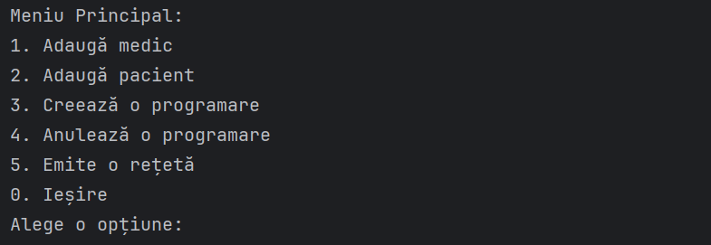

---

## 3. Tehnologii utilizate / Software

*   **Limbaj de programare:**
    *   Java JDK - versiunea 17
*   **Management proiect și dependențe:**
    *   Apache Maven
*   **Testare Funcțională:**
    *   JUnit 5 (Jupiter) - Teste rulate - versiunea 5.9.3
    *   AssertJ Core - Bibliotecă aserțiuni teste - am folosit pentru o lizibilitate mai bună - versiunea 3.24.2
    *   Mockito Core - Framework pentru a crea obiecte false - izolare unități de cod testate - versiunea 5.11.0
*   **Testare Structurală:**
    *   Plugin IntelliJ IDEA - Rapoarte acoperite generate în IDE
*   **Testare prin Mutație (Mutation Testing):**
    *   PITest (PIT) JUnit 5 - Sistem de testare prin mutație pentru Java, codifică codul sursă prin mutanți și verifică dacă testele pot detecta acele modificări - versiunea 1.2.3
*   **Bază de Date:**
    *   PostgreSQL JDBC Driver - Driver pentru conectarea aplicației la o bază de date - versiunea 42.7.2
*   **Mediul de dezvoltare IDE:**
    *   IntelliJ IDEA Ultimate 2024

---

## 4. Configurare și rulare

*   **Cerințe preliminare:**
    *   Java Development Kit
    *   Apache Maven
    *   PostgreSQL
    *   IDE
*   **Configurare aplicație:**
    *   Instalare dependențe din `pom.xml` pentru Maven
    *   Creare bază de date
    *   Actualizare `application.properties` pentru date conectare la baza de date
*   **Compilare proiect:**
    *   Comanda din Maven - `mvn clean package` - curăță build-uri anterioare, compilează codul și rulează testele funcționale JUnit (toate încropite într-un fișier de tip JAR executabil), conform `pom.xml`
*   **Rulare aplicație**
*   **Rulare Teste:**
    *   Testare funcțională JUnit 5 - `mvn test` - rezultate în `surefire-reports`
    *   Testare structurală (Coverage) - `mvn clean verify` / sau run test with coverage direct din IDE - raport coverage direct pe IDE
    *   Testare prin mutație PITest - `mvn org.pitest:pitest-maven:mutationCoverage` - raport `index.html`

---

## 5. Hardware

*   **CPU:** Intel Core 12th Gen Intel(R) i5-12500H (16 CPUs), max 4.5GHz
*   **RAM:** 16GB LPDDR5 4800MHz
*   **SSD:** 512GB M.2 PCIe NVMe 4.0
*   **GPU:** Intel Iris Xe Graphics
*   **SO:** Windows 11 Home 64-bit

---

## 6. Strategii de testare

### A. Testare Funcțională

#### A.1. Partiționare în clase de echivalență
Presupune împărțirea datelor de intrare în grupuri pentru care se așteaptă sistemul să aibă rezultate similare. Testăm o valoare din fiecare clasă și menținem o acoperire bună a scenariilor.

*   **Test 1 - `MedicTest.java`**
    *   **Funcționalitate testată:** inițializare obiect `Medic` folosind constructor parametrizat
    *   **Date de intrare:** set de valori pentru id, nume și specializare
    *   **Test:** `constructorParametrizat()`
        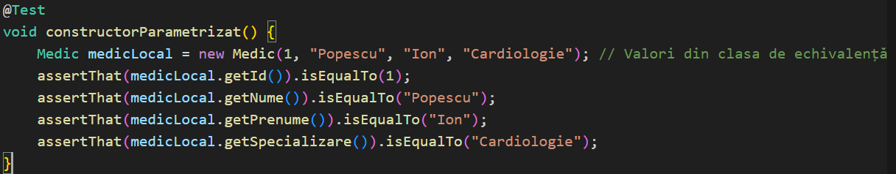
    *   **Explicație:** utilizăm un set de date a tuturor combinațiilor posibile de parametri valizi, pentru a verifica dacă este creat corect.

*   **Test 2 - `PacientTest.java`**
    *   **Funcționalitate testată:** setare și obținere CNP pacient
    *   **Date de intrare:** valoare CNP
    *   **Clase de echivalență:** CNP valid, CNP gol, CNP nul
    *   **Test:** `CNPgol()`
        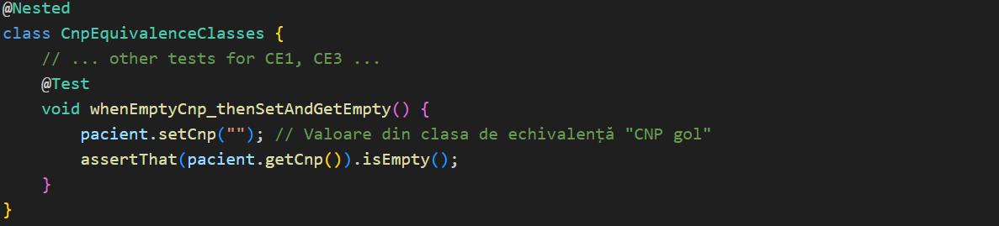
    *   **Explicație:** se așteaptă ca sistemul să accepte un CNP gol și să îl stocheze.

*   **Test 3 - `ProgramareTest.java`**
    *   **Funcționalitate testată:** obținere ID pacient din programare
    *   **Clasă de echivalență:** programare cu ID valid de pacient
    *   **Test:** `pacientIdCorect()`
        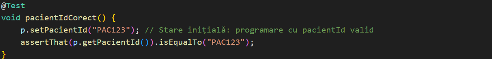
    *   **Explicație:** verifică dacă `getPacientId()` returnează corect valoarea pentru o programare cu `pacientId` setat valid.

*   **Test 4 - `RetetaTest.java`**
    *   **Funcționalitate testată:** starea inițială a unui obiect `Reteta` cu constructor implicit
    *   **Clasă de echivalență:** orice obiect `Reteta` nou creat în `new Reteta()`. Se așteaptă aceeași stare inițială.
    *   **Test specific:** `campuriImpliciteNull()`
        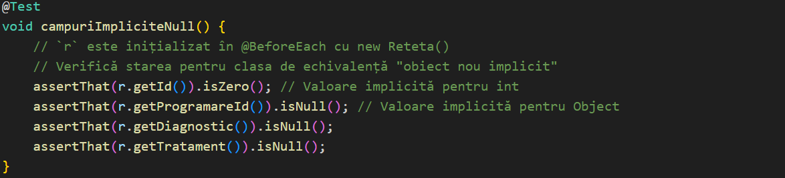
    *   **Explicație:** testul validează că un obiect `Reteta` aparține clasei de echivalență a obiectelor cu câmpuri neinițializate sau default Java.

*   **Test 5 - `CabinetMedicalTest.java`**
    *   **Funcționalitate testată:** căutare medic în cabinet
    *   **Date de intrare:** ID medic
    *   **Clase de echivalență:** ID medic care există / care nu există
    *   **Test specific:** `medicNuExista()`
        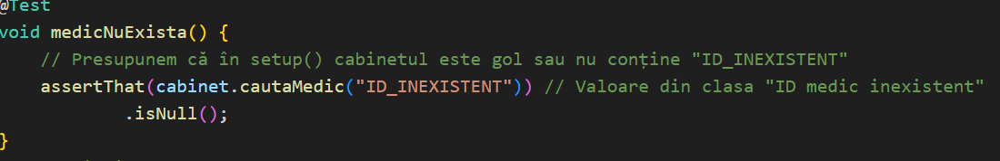
    *   **Explicație:** verifică dacă metoda returnează `null`.

*   **Test 6 - `ConsoleUITest.java`**
    *   **Funcționalitate testată:** procesarea unei opțiuni din meniul principal al consolei
    *   **Date de intrare:** opțiunea aleasă
    *   **Clase de echivalență:** cifră corespunzătoare / număr sau text invalid / intrare goală
    *   **Test specific:** `OptiuneNonNumerica()`
        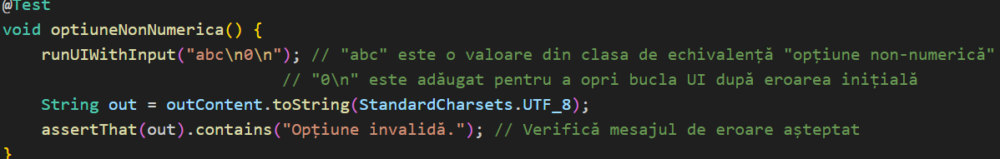
    *   **Explicație:** "abc" ca intrare și se verifică dacă afișează mesaj de eroare, pentru acest tip de intrare.

#### A.2. Analiza valorilor de frontieră (BVA)
Se concentrează pe testarea valorilor de la marginile sau frontierele claselor de echivalență. Folosit pentru intervale numerice, lungimi de șiruri de caractere sau la limitele colecțiilor (goală / plină).

*   **Test 1 - `MedicTest.java`**
    *   **Funcționalitate testată:** setare ID medic
    *   **Clase de echivalență:** ID negativ, zero, pozitive
    *   **Valori de frontieră:** 0, -5, 123
    *   **Test:** `seteazaIdValori()` și `IdImplicitZero()`
        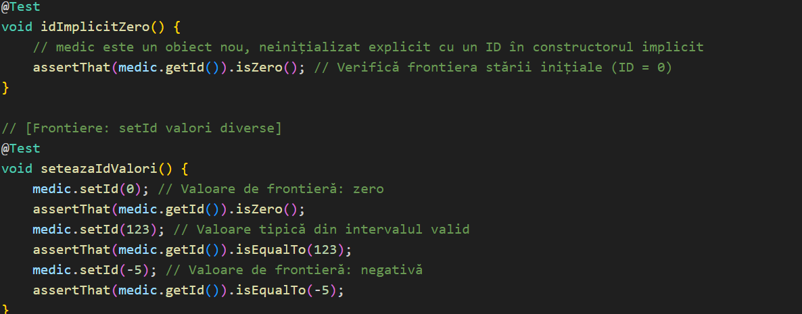

*   **Test 2 - `PacientTest.java`**
    *   **Funcționalitate testată:** setare CNP pacient (constrângere lungime)
    *   **Clasă de echivalență:** CNP lungime 13, CNP lungime diferită de 13
    *   **Valori de frontieră:** 12, 13, 14
    *   **Test:** Lungime 12 - `CnpBoundaryAnalysis.whenCnpLength12_thenSetAndGet()`
        
    *   **Explicație:** verifică comportamentul la 12.

*   **Test 3 - `ProgramareTest.java`**
    *   **Funcționalitate testată:** calcul `HashCode()` pentru obiect din `Programare`
    *   **Clasă de echivalență:** obiect `Programare` neinițializat vs `Programare` inițializat
    *   **Valoare de frontieră:** trecerea de la o stare unde `HashCode()` ar putea să fie 0 la o stare diferită de zero
    *   **Test:** `hashCodeNonZero()`
        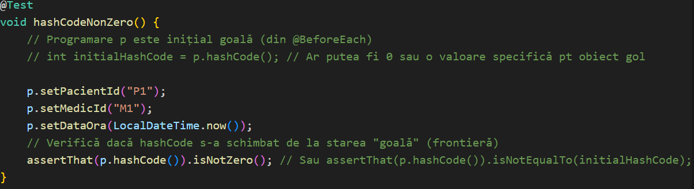
    *   **Explicație:** verifică popularea câmpurilor, se verifică specific `isNotZero()`.

*   **Test 4 - `RetetaTest.java`**
    *   **Funcționalitate testată:** setare diagnostic rețete
    *   **Clase de echivalență:** diagnostic valid, gol și nul
    *   **Valoare de frontieră:** șirul gol `""` (între nul și cu conținut)
    *   **Test:** `diagnosticGolEsteAcceptat()`
        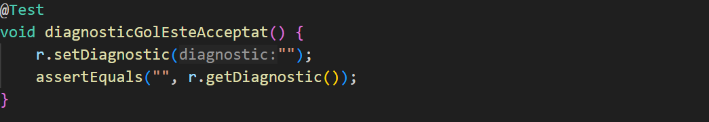
    *   **Explicație:** verifică comportament la setare diagnostic cu șir gol.

*   **Test 5 - `CabinetMedicalTest.java`**
    *   **Funcționalitate testată:** adăugarea și căutare medic din listă
    *   **Clase de echivalență:** listă goală, cu un element, mai multe elemente
    *   **Valoare de frontieră:** o listă goală pentru operații cu colecții
    *   **Test:** `MedicNuExista()`
        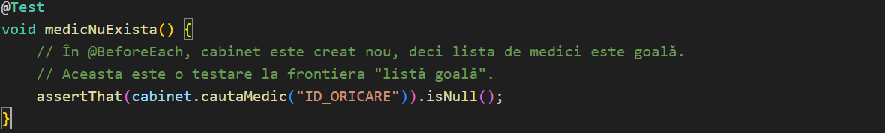
    *   **Explicație:** când `medicNuExista()` este rulat imediat după `setup()`, lista de medici din cabinet este goală, `cautaMedic` verificat la frontiera unei colecții goale.

*   **Test 6 - `ConsoleUITest.java`**
    *   **Funcționalitate testată:** selectare opțiuni meniu
    *   **Clase de echivalență:** opțiuni valide, invalide
    *   **Valori de frontieră:** valide: 0, 5; invalide: -1, 6
    *   **Test:** frontiera validă 0 - `testAfișareMeniuPrincipal`
        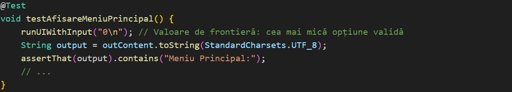
    *   **Explicație:** gestionarea corectă a erorilor pentru valori de frontieră.

### B. Testare Structurală
Am folosit această strategie pentru cunoașterea detaliată a structurii interne a codului sursă, anume: logica, ramurile de decizie, buclele și căile de execuție. Scopul a fost pentru a proiecta teste care să asigure că părți ale codului sunt executate.

#### B.1. Acoperire la nivel de instrucțiune
Pentru a asigura că fiecare linie de cod (instrucțiune) este executată cel puțin o dată.

*   **Test 1 - `MedicTest.java`**
    *   **Metode / Instrucțiuni:** interior metoda `setSpecializare()` și instrucțiunea returnare `getSpecializare()`
    *   **Structura vizată:** execuția liniilor `this.specializare = specializare;` din setter și `return this.specializare` din getter
    *   **Test:** `specializareValida()`
        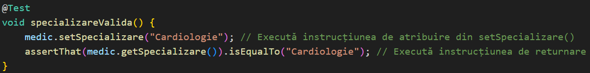
    *   **Explicație:** se asigură că instrucțiunile se execută cel puțin o dată.

*   **Test 2 - `PacientTest.java`**
    *   **Metode / Instrucțiuni:** instrucțiuni atribuire constructor implicit și din setter `setNume()`, getter `getNume()`
    *   **Structura vizată:** `this.nume = nume` din `setNume()` și `return this.nume` din `getNume()`
    *   **Test:** `gettersAndSetters_workCorrectly`
        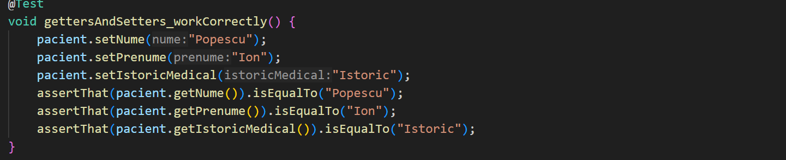
    *   **Explicație:** se asigură că instrucțiunile sunt executate.

*   **Test 3 - `ProgramareTest.java`**
    *   **Metode / Instrucțiuni:** instrucțiuni atribuire `setPacientId()` și return `getPacientId()`
    *   **Structura vizată:** `this.pacientId = pacientId` și `return this.pacientId`
    *   **Test:** `PacientIdCorect()`
        
    *   **Explicație:** se asigură că instrucțiunile sunt executate.

*   **Test 4 - `RetetaTest.java`**
    *   **Metode / Instrucțiuni:** instrucțiuni atribuire constructor implicit
    *   **Structura vizată:** execuția constructorului `public Reteta ()` și verificarea stării inițiale a câmpurilor
    *   **Test:** `campuriImpliciteNull()`
        
    *   **Explicație:** verificare câmpuri după ce obiectul `r` a fost creat cu `new Reteta()` în `setup()` confirmă că instrucțiunile de inițializare a câmpurilor au fost executate.

*   **Test 5 - `CabinetMedicalTest.java`**
    *   **Metode / Instrucțiuni:** adăugare `Pacient` în lista internă
    *   **Structura vizată:** execuția `pacienti.add(pacient)` din metoda `adaugaPacient` a serviciului
    *   **Test:** `adaugaPacientValid()`
        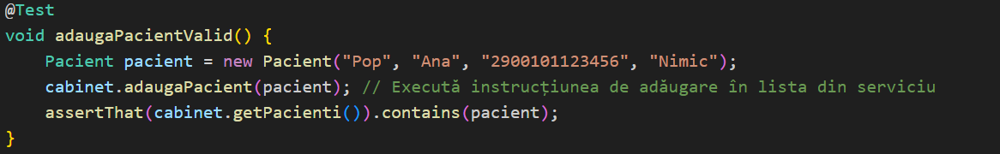
    *   **Explicație:** apelarea `cabinet.adaugaPacient(pacient)` - asigurăm că instrucțiunea responsabilă este executată.

*   **Test 6 - `ConsoleUITest.java`**
    *   **Metode / Instrucțiuni:** instrucțiunile `System.out.println()` care afișează prompt-uri pentru adăugare pacient și apelul `cabinetMock.adaugaMedic()`
    *   **Structura vizată:** execuția instrucțiunilor de afișare mesaje și a instrucțiunii pentru adăugare pacient către serviciu
    *   **Test:** `testAdaugaMedicFlow()`
        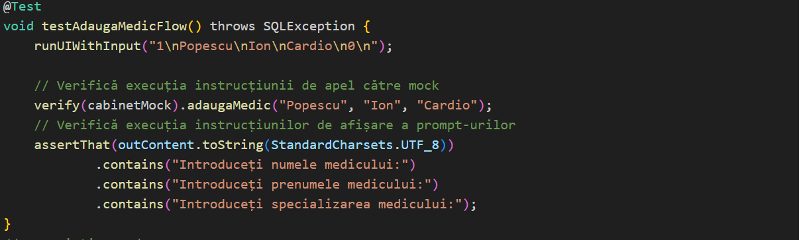
    *   **Explicație:** asigură că instrucțiunile din `ConsoleUI` care afișează cererile de informații pentru un pacient sunt executate (`assertThat(outContent)`) și prin `verify(cabinetMock)` se confirmă că instrucțiunea care apelează `adaugaMedic` a fost executată.

#### B.2. Acoperire nivel decizie / ramură
Asigurăm că fiecare posibil rezultat al unei structuri de decizie este parcurs cel puțin o dată.

*   **Test 1 - `MedicTest.java`**
    *   **Metoda / Decizia:** Metoda `equals(Object obj)` din `Medic` și decizia `if (obj == null) return false`
    *   **Structura:**
        *   Ramura 1 (True): `obj` null ==> `return false`
        *   Ramura 2 (False): `obj` not null ==> continuă după `if`
    *   **Test Ramura 1 - True:** `equalsCuNull()`
        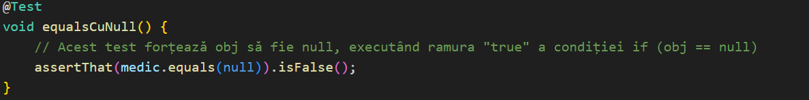
    *   **Test Ramura 2 - False:** `equalsAceeasiReferinta()`
        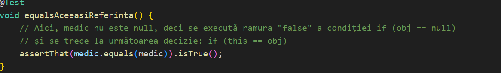

*   **Test 2 - `PacientTest.java`**
    *   **Metoda / Decizia:** Metoda `equals(Object obj)` din `Pacient`. Decizia `if (getClass() != obj.getClass()) return false`
    *   **Structura:**
        *   Ramura 1 (True): clasa `obj` `this != obj` ==> `false`
        *   Ramura 2 (False): clasele identice ==> continuă execuția
    *   **Test Ramura 1 - True:** `equals_differentClass()`
        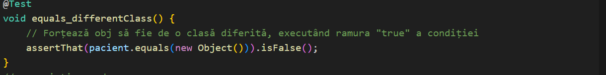
    *   **Test Ramura 2 - False:** `equals_sameObject()`
        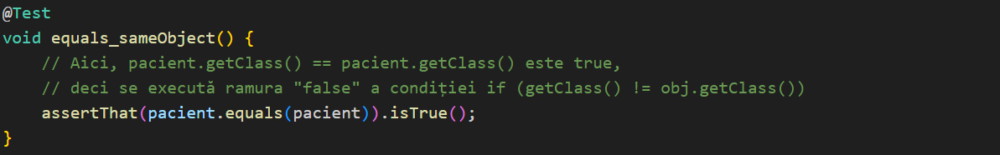

*   **Test 3 - `ProgramareTest.java`**
    *   **Metoda / Decizia:** Metoda `equals(Object obj)` din `Programare`. Decizia care compară un câmp `if (!Objects.equals(pacientID, other.pacientId)) return false`
    *   **Structura:**
        *   Ramura 1 (True): `pacientId` sunt diferite ==> `false`
        *   Ramura 2 (False): `pacientId` sunt egale ==> continuă execuția
    *   **Test Ramura 1 - True:** `equalsPacientDiferit()`
        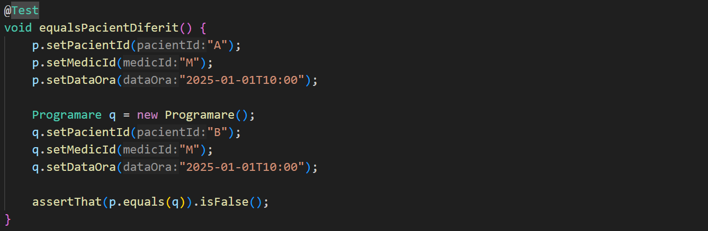
    *   **Test Ramura 2 - False:** `equalsMedicDiferit()` - `pacientId` egal, `medicId` diferit
        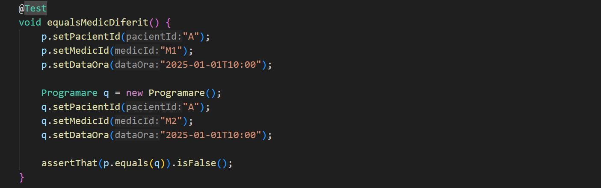

*   **Test 4 - `RetetaTest.java`**
    *   **Metoda / Decizia:** Metoda `equals(Object obj)` din `Reteta`. Decizia `if (obj == null) return false`
    *   **Structura:**
        *   Ramura 1 (True): `obj` null ==> `false`
        *   Ramura 2 (False): `obj` nu este null ==> se continuă execuția
    *   **Test Ramura 1 - True:** `equalsCuNull()`
        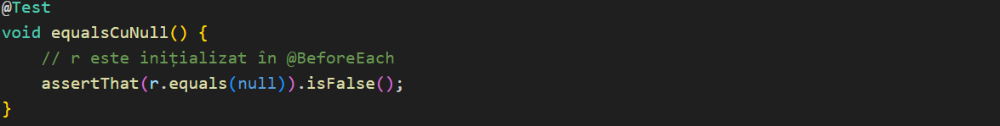
    *   **Test Ramura 2 - False:** `equalsAceeasiReferinta()`
        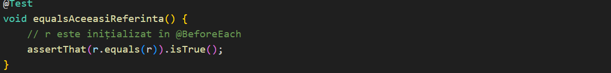

*   **Test 5 - `CabinetMedicalTest.java`**
    *   **Metoda / Decizia:** `CabinetMedical.anuleazaProgramare(Programare p)` - succesul operației `programari.remove(p)`
    *   **Structura:**
        *   Ramura 1: `p` există în lista de programări și este ștearsă
        *   Ramura 2: `p` nu există în lista de programări (neschimbată)
    *   **Test Ramura 1:** `stergeProgramareExista()`
        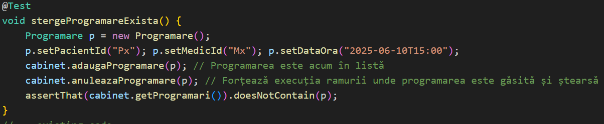
    *   **Test Ramura 2:** `stergeprogramareInexista()`
        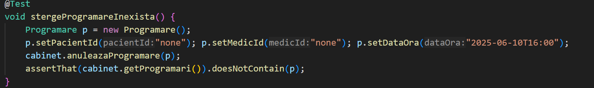

*   **Test 6 - `ConsoleUITest.java`**
    *   **Metoda / Decizia:** `switch` din `ConsoleUI.start()` care procesează opțiunile. Fiecare `case` și ramura `default` reprezintă decizie.
    *   **Structura:** execuție fiecare bloc `case` și a `default`
    *   **Test Case 1:** `testAdaugaMedicFlow()`
        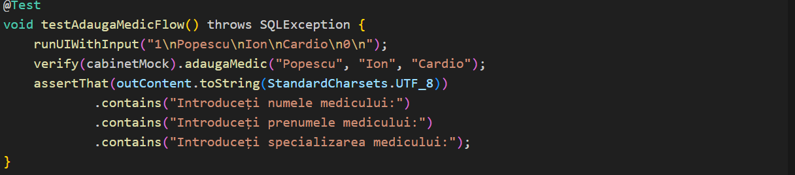
    *   **Explicație:** fiecare test flow testează o ramură `case` din `switch` + `default`.

#### B.3. Acoperire nivel condiție
Folosim acest nivel de acoperire pentru multiple condiții atomice (sub-condiții) combinate prin operatori logici, fiecare condiție să fie evaluată `true` cât și `false` cel puțin o dată. Descoperire erori.

*   **Metoda 1 - `Programare.equals(Object obj)`**
    *   **Decizie compusă:** `if (obj == null || getClass() != obj.getClass()) {return false}`
    *   **Condiții atomice:** `obj == null` (C1) și `getClass() != obj.getClass()` (C2)
    *   **Structura:** C1 și C2 evaluate la `true` și `false`
    *   **Test C1 la True:** `equalsCuNull()` - `ProgramareTest.java`
        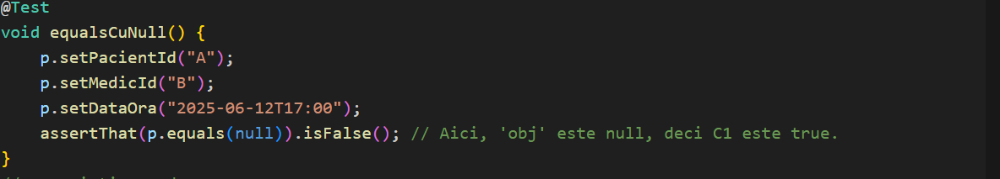
    *   **Test C1 la False și C2 la True:** `comparatieAltaClasa()` din `CabinetMedicalTest.java`
        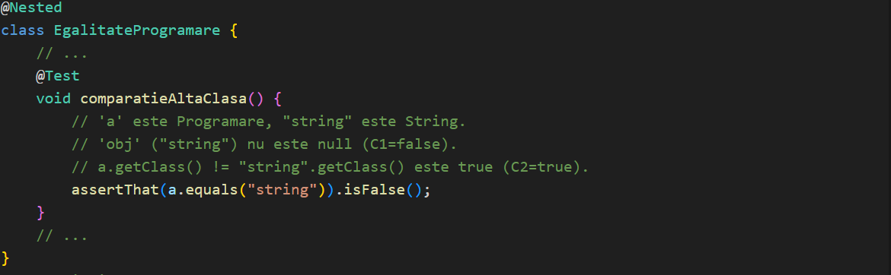
    *   **Test C1 la False și C2 la False:** `simetric()` din `CabinetMedicalTest.java`
        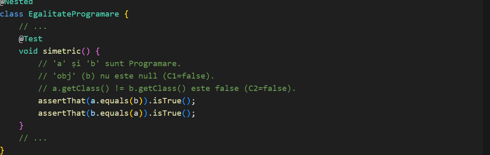
    *   **Explicație:** contribuie la partea inițială a metodei.

*   **Metoda 2 - `Pacient.setCNP(String cnp)`**
    *   **Decizie compusă:** `if (cnp == null || cnp.trim().isEmpty()) {throw new IllegalArgumentException("CNP invalid"); }`
    *   **Condiții atomice:** `cnp == null` (C1) și `cnp.trim().isEmpty()` (C2)
    *   **Structura:** C1 și C2 evaluate la `true` și `false`
    *   **Test `PacientTest.java` (CnpEquivalenceClasses) C1 True:** `whenNullCnp_thenThrowsExceptions()`
        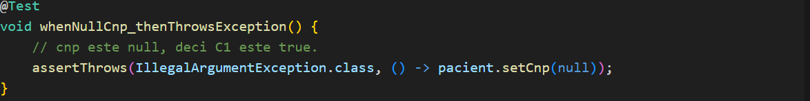
    *   **Test C1 False și C2 True:** `whenEmptyCnp_thenThrowsException()`
        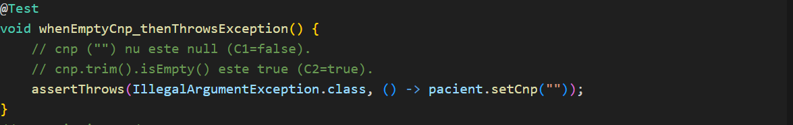
    *   **Test C1 False și C2 False:** `whenValidCnpLength13_thenSetAndGet()`
        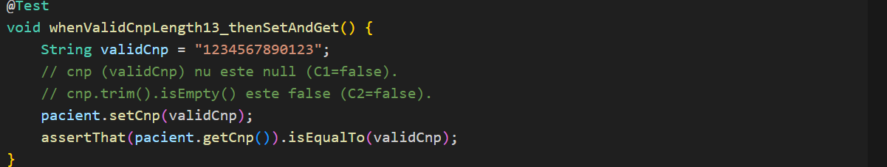

#### B.4. Acoperire circuite independente
Urmărim executarea cât mai multor instrucțiuni și parcurgerea tuturor ramurilor decizionale. Complexitatea ciclomatică a unei metode oferă o limită superioară pentru numărul de teste necesare pentru a acoperi toate căile liniar independente.

*   **Test 1 - `MedicTest.java`**
    *   **Funcționalitate / Metodă:** `equals()` din `Medic`.
    *   **Căi de testat:**
        *   Calea 1: `obj` este `this` (reflexivitate) ==> `equalsAceeasiReferinta()`
        *   Calea 2: `obj` este `null` ==> `equalsCuNull()`
        *   Calea 3: `obj` este de altă clasă ==> `equalsCuAltaClasa()`
        *   Calea 4: toate câmpurile egale ==> `equalsObiecteEgale()`
        *   Calea 5: ID diferite, restul egale ==> `equalsDiferit()`, similar nume, prenume, specializare

*   **Test 2 - `ProgramareTest.java`**
    *   **Funcționalitate / Metodă:** `Programare.equals(Object obj)`
    *   **Căi de testat:**
        *   Calea 1: aceeași referință ==> `equalsAceeasiInstanta()`
        *   Calea 2: `obj` este `null` ==> `equalsCuNull()`
        *   Calea 3: `obj` este de altă clasă ==> `equalsCuAltaClasa()`
        *   Calea 4: primul câmp `pacientId` diferă ==> `equalsPacientDiferit()`
        *   Calea 5: `medicId` diferit ==> `equalsMedicDiferit()`
        *   Calea 6: `dataOra` diferă ==> `equalsDataDiferita()`
        *   Calea 7: `equalsToateEgale()`

*   **Test 3 - `ConsoleUITest.java`**
    *   **Funcționalitate / Metodă:** `ConsoleUI.start()`. Switch (if-else if)
    *   **Căi de testat:**
        *   Calea 1: "1" ==> `testAdaugaMedicFlow()`
        *   Calea 2: "2" ==> `testAdaugaPacientFlow()`
        *   Calea 3: "3", "4", "5" ==> teste corespunzătoare
        *   Calea 4: "0" ==> `TestAfisareMeniuPrincipal()`
        *   Calea 5: "9" ==> `optiuneInvalidaEroare()`
        *   Calea 6: "abc" ==> `optiuneNonNumerica()`
    *   **Explicație:** se direcționează execuțiile pe căi distincte, corespunzătoare opțiunilor.

### C. Testare prin Mutație
Tehnică de testare structurală utilizată pentru a evalua calitatea și puterea unei suite de teste. Scenarii pe care testele nu le acoperă suficient de bine.

*   **Proces:**
    1.  Introducere automată modificări (mutații) în cod sursă. Schimbare operator, ștergere linii cod, înlocuire constante.
    2.  Suita de teste rulată pe fiecare mutant.
    3.  Dacă suita eșuează ==> mutant omorât (testele detectează modificarea).
    4.  Dacă suita nu eșuează ==> mutant supraviețuit (testele nu detectează modificarea).
    5.  Scop: cât mai mare procent de acoperire.

*   **Teste pentru eliminarea mutanților rămași:**

    *   **Test 1 - `equalsDataDiferitaFalse()` - pentru a elimina un mutant în `Programare.equals()` din `CabinetMedicalTest.java`**
        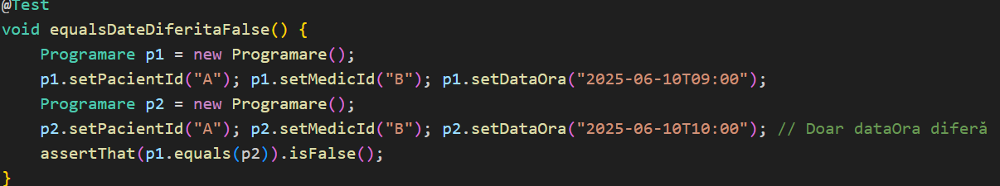
        *   **Context:** Presupunem că metoda `Programare.equals(Object obj)` conține următoarea logică pentru a compara câmpul `dataOra`:
            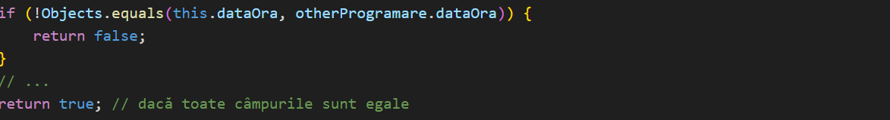
            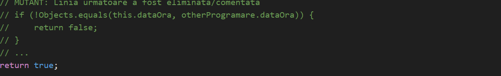
        *   **Eliminare mutant:** testul creează două obiecte `Programare` `p1` și `p2`, care sunt identice cu excepția `dataOra`. Dacă mutantul ignoră comparația, atunci returnează `true` pentru `p1.equals(p2)`, dar aserțiunea este `assertThat(p1.equals(p2)).isFalse()`. Deoarece mutantul returnează `true` iar testul așteaptă `false` - va eșua, astfel este eliminat.

    *   **Test 2 - `equalsPacientMedicDiferitFalse()` în `Programare.equals()` din `CabinetMedicalTest.java`**
        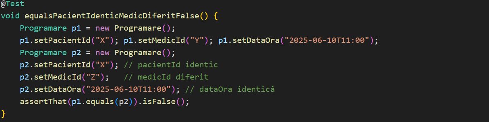
        *   **Context:** P.p. `medicId` similar
            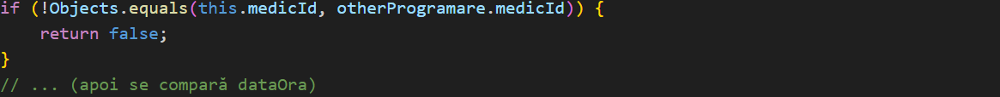
            
        *   **Eliminare mutant:** testul creează `p1` și `p2` identice, a.î. `pacientId` și `dataOra` identice și `medicId` diferit - similar cu test 1.

*   **Teste suplimentare eliminare mutanți:**
    *   Nu se verificau efectiv prompt-uri/mesaje afișate la consolă.
        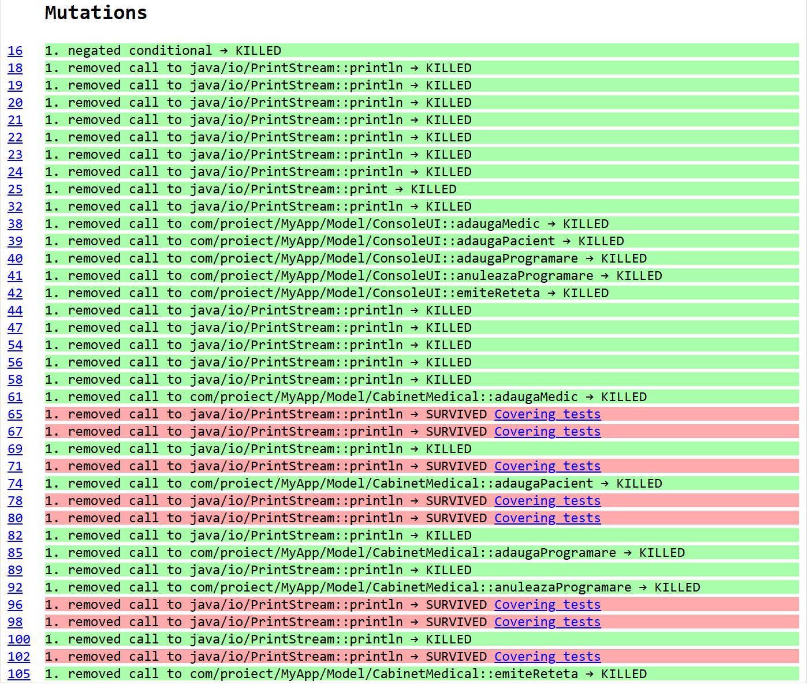
    *   Noul test simulează o serie completă de interacțiuni cu interfața utilizator din consolă, astfel aserțiunile verifică dacă un anumit prompt este prezent în output.
        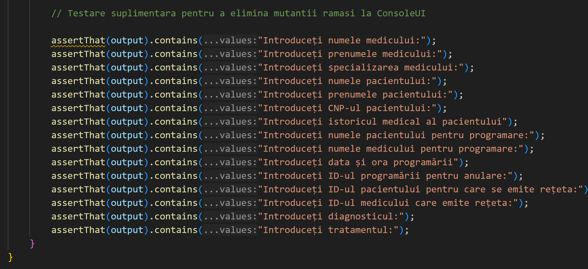

---

## 7. Rezultate și Concluzii

### A. Testare Funcțională pachet `com.proiect.MyApp.Model` - Raport
Testele au demonstrat că se comportă conform așteptărilor pentru cazurile de testare definite.
[Raport Teste Funcționale](<Test%20Results%20-%20test_in_ProiectRC.html>)

### B. Testare Structurală pachet `com.proiect.MyApp.Model` - Raport
Raportul a relevat o bună acoperire internă a codului, cu reflectarea corectitudinii implementării.
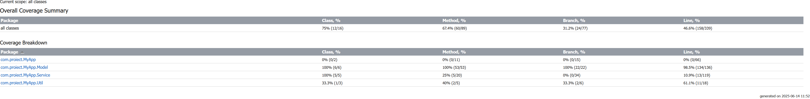
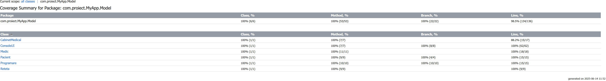

### C. Testare prin Mutație pachet `com.proiect.MyApp.Model` - Raport
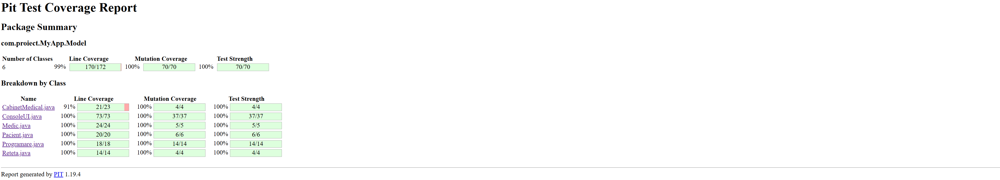
Line coverage 21/23 deoarece niciun test nu provoacă `Exception` în timpul execuției `try` (se desfășoară întotdeauna cu succes). Greu de simulat acoperirea blocului `catch`.
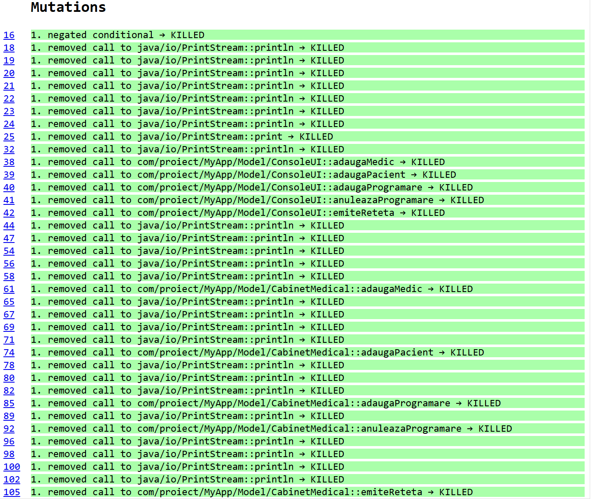
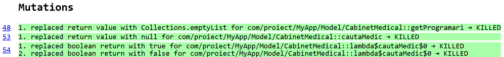
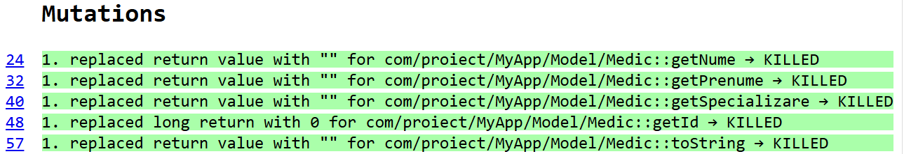
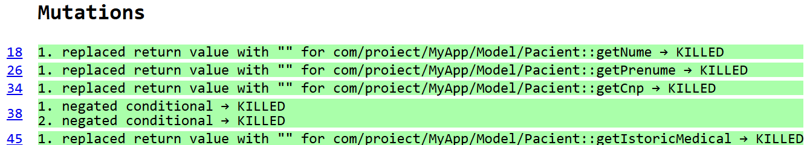
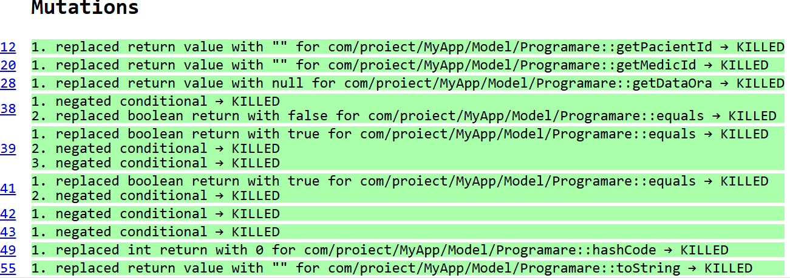
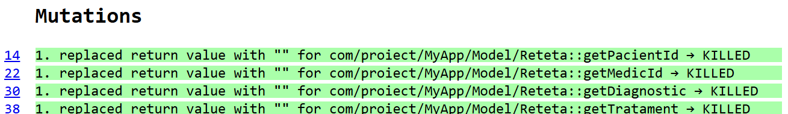

### D. Raport AI pachet `com.proiect.MyApp.Model` - ChatGPT
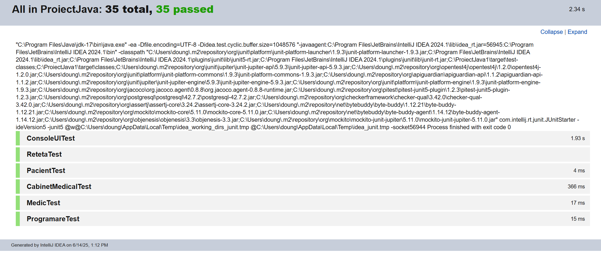
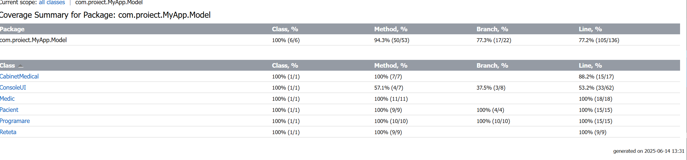
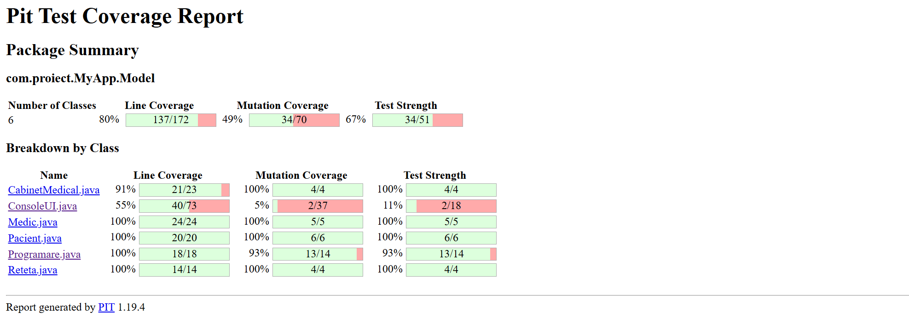
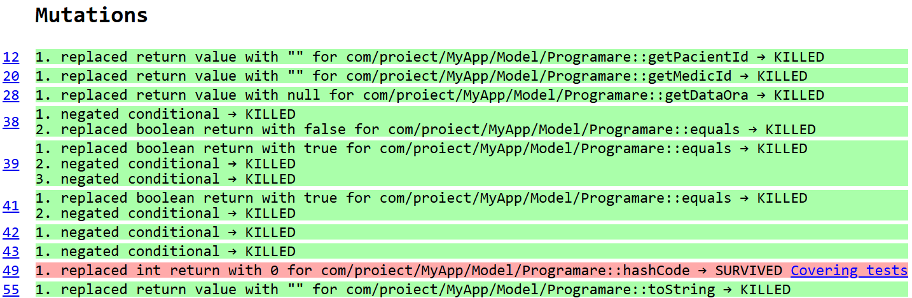
Cauze probabile: Testele nu verifică output-ul efectiv la consolă pe care `ConsoleUI` îl generează (prompt-uri, mesaje). Nicio aserțiune nu le validează.
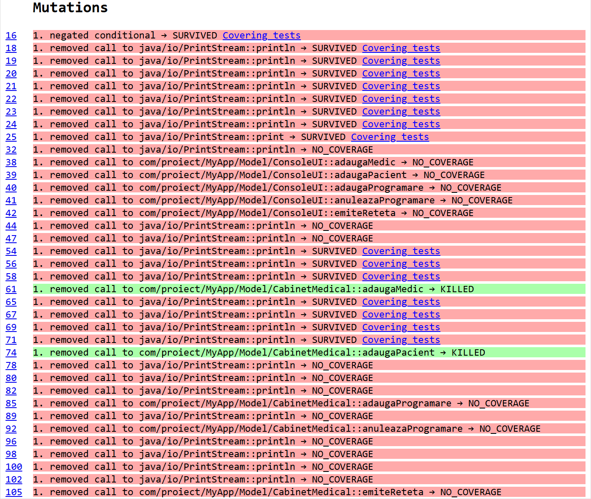

---

## 8. Referințe

1.  JUnit 5 Documentation
2.  PITest Mutation Testing
3.  ChatGPT (generare teste automate, configurare pom, asistare teste)
4.  Mockito Documentation
5.  AssertJ Documentation
6.  Dobrescu, Ion. *Software Testing in Java*, 2022
7.  Documentație curs TSS 2025
8.  IntelliJ IDEA Documentation
9.  Maven - Build Automation Tool
10. Oracle - Java Documentation
11. BellSoft, „A comprehensive Guide to Mutation Testing In Java”, 2025
12. Baeldung, „Mutation Testing with PITest”, 2023
