**--- 2025 ---**

Proiect realizat de CAMCIUC Robert-Cristian

Disciplina Testarea Sistemelor Software

**Testare unitară în Java**

**--- Cuprins ---**

1. Descriere generală aplicație
2. Funcționalități implementate
3. Tehnologii utilizate
4. Configurare și rulare
5. Hardware / Software 
6. Strategii de testare 
7. Rezultate 
8. Concluzii 
9. Referințe

**--- 1. Descriere generală aplicație ---**

Aplicație pentru baza de date a clinicii și pentru gestionarea programărilor medicale efectuate sau care urmează, scrisă în limbajul Java, cu interfață interactivă pe consolă. Scopul aplicației este de a facilita procesul de programare a consultațiilor medicale, oferind astfel o experiență ușoară și eficientă pentru administratorii rezervărilor din cadrul clinicii. Pentru acest proiect se vor efectua teste pe anumite clase din punct de vedere funcțional, structural și prin mutation testing.

**--- 2. Funcționalități implementate ---**

Aplicația de gestionare a clinicii medicale oferă următoarele funcționalități principale:

    A. Gestionare Medicilor
        Adaugare Medic:
            Parametri de intrare:
                Nume medic - String
                Prenume medic - String
                Specializare medic - String
            Validări (implicite):
                Câmpurile nu sunt nule
                Format nume și prenume
            Acțiuni efectuate:
                ConsoleUI colectează datele de la utilizator
                Se creează obiect Medic cu datele furnizate
                Obiectul Medic este transmis metodei adaugăMedic din CabinetMedicalService (via CabinetMedical)
                Serviciul adauga medicul in colectia interna, printr-o integrare cu baza de date prin MedicService
            Feedback către utilizator:
                Mesaj de confirmare
                Mesaj de eroare
            Referinte cod:
                ConsoleUI.java - adaugaMedic(), CabinetMedicalService.java - adaugaMedic()   

    B. Gestionare Pacienți
        Adaugare pacient:
            Parametri de intrare:
                Nume pacient - String
                Prenume pacient - String
                CNP - String
                Istoric Medical - String
            Validări (implicite/așteptate)
                Numele, prenumele și CNP nu trebuie sa fie nule
                Format și unicitate CNP
            Acțiuni efectuate:
                ConsoleUI colectează datele
                Se creeaza obiectul Pacient
                Obiectul Pacient este transmis metodei adaugaPacient din CabinetMedicalService
                Serviciul adauga pacientul in colectia interna prin PacientService
            Feedback catre utilizator
                Mesaj de confirmare
                Mesaj de eroare
            Referinte cod:
                ConsoleUI.java - adaugaPacient(), CabinetMedicalService.java - adaugaPacient()

    C. Gestionare Programări
        Crearea unei noi programari
            Parametri de intrare:
                ID pacient, ID medic (int), data și ora - String
            Validari:
                Existenta pacient ID si medic ID
                Format corect data și oră
                Data programării să fie în viitor
                Disponibilitate medic la data și ora specificată
            Actiuni efectuate:
                ConsoleUI colectează ID-urile și data/ora
                Se parsează data/ora într-un format adecvat
                Se creează un nou obiect Programare.
                Obiectul Programare este transmis metodei adaugaProgramare din CabinetMedicalService.
                Serviciul adaugă programarea în colecția internă prin ProgramareService.
            Feedback către utilizator:
                Mesaj de confirmare
                Mesaj de eroare
            Referințe cod: 
                ConsoleUI.java - adaugaProgramare(), CabinetMedicalService.java - adaugaProgramare()
        Anularea unei programari existente:
            Parametri de intrare:
                ID-ul programării de anulat (int)
            Validări (implicite/așteptate):
                Existența programării cu ID-ul specificat.
            Acțiuni efectuate:
                ConsoleUI colectează ID-ul programării.
                ID-ul este transmis metodei anuleazaProgramare din CabinetMedicalService.
                Serviciul caută și șterge programarea din colecția internă și din baza de date (prin ProgramareService).
            Feedback către utilizator:
                Mesaj de confirmare
                Mesaj de eroare
            Referințe cod: ConsoleUI.java - anuleazaProgramare(), CabinetMedicalService.java - anuleazaProgramare()

    D. Gestionare Rețete
        Emiterea unei rețete:
            Parametri de intrare:
                ID-ul programării pentru care se emite rețeta (int)
                Diagnosticul (String)
                Tratamentul (String)
            Validări (implicite/așteptate):
                Existența programării cu ID-ul specificat.
                Programarea să nu aibă deja o rețetă asociată (dacă se impune o limită de o rețetă per programare).
                Câmpurile diagnostic și tratament nu ar trebui să fie goale.
            Acțiuni efectuate:
                ConsoleUI colectează datele.
                Se creează un nou obiect Reteta.
                Obiectul Reteta este transmis metodei emiteReteta din CabinetMedicalService, împreună cu ID-ul programării.
                Serviciul asociază rețeta cu programarea corespunzătoare, o adaugă în colecția internă și o persistă prin RetetaService.
            Feedback către utilizator:
                Mesaj de confirmare
                Mesaj de eroare
            Referințe cod: ConsoleUI.java - emiteReteta(), CabinetMedicalService.java - emiteReteta()

    E. Ieșire din aplicație
        Parametri de intrare: Niciunul (selecția opțiunii din meniu).
        Validări: Niciuna.
        Acțiuni efectuate:
            Bucla principală a ConsoleUI se încheie.
            Aplicația își termină execuția.
        Feedback către utilizator: Mesaj de ieșire 

    Fluxul ==> UI ==> Cabinet ==> Service ==> DB

        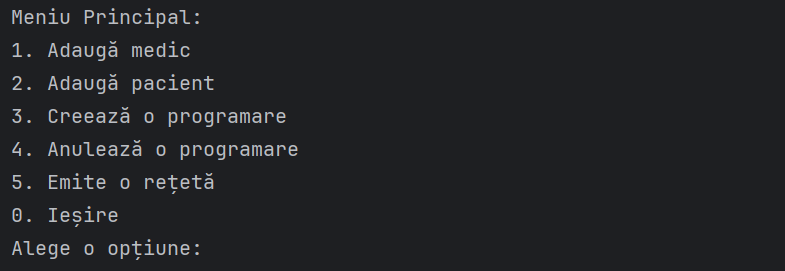

**--- 3. Tehnologii utilizate / Software ---**

Limbaj de programare              
    Java JDK - versiunea 17

Management proiect și dependențe  
    Apache Maven

Testare Funcțională               
    Junit 5 (Jupiter)           - Teste rulate - versiunea 5.9.3
    AssertJ Core                - Bibliotecă aserțiuni teste - am folosit pentru o lizibilitate mai bună - versiunea 3.24.2
    Mockito Core                - Framework pentru a crea obiecte false - izolare unități de cod testate - versiunea 5.11.0

Testare Structurală 
    Plugin IntelliJ IDEA        - Rapoarte acoperite generate în IDE 

Testare prin Mutație (Mutation Testing)
    PITest (PIT) Junit 5        - Sistem de testare prin mutație pentru Java, codifică codul sursă prin mutanți și verifică dacă testele pot detecta acele modificări - versiunea 1.2.3 

Bază de Date
    PostgreSQL JDBC Driver      - Driver pentru conectarea aplicației la o bază de date - versiunea 42.7.2

Mediul de dezvoltare IDE
    IntelliJ IDEA Ultimate 2024

**--- 4. Configurare și rulare ---**

Cerințe preliminare
    Java Development Kit
    Apache Maven
    PostgreSQL
    IDE

Configurare aplicație 
    Instalare dependențe din pom.xml pentru Maven
    Creare baza de date 
    Actualizare application.properties pentru date conectare la baza de date

Compilare proiect
    Comanda din Maven - mvn clean package - curata build-uri anteriore, compilează codul și rulează testele funcționale Junit (toate încropite într-un fișier de tip JAR executabil), conform pom.xml

Rulare aplicație

Rulare Teste
    Testare funcțională Junit 5     - mvn test - rezultate in surefire-reports
    Testare structurală (Coverage)  - mvn clean verify / sau run test with coverage direct din IDE - raport coverage direct pe IDE
    Testare prin mutație PITest     - mvn org.pitest:pitest-maven:mutationCoverage - raport index.html
    

**--- 5. Hardware ---**

    CPU: Intel Core 12th Gen Intel(R) i5-12500H (16 CPUs), max 4.5GHz
    RAM: 16GB LPDDR5 4800MHz
    SSD: 512GB M.2 PCIe NVMe 4.0
    GPU: Intel Iris Xe Graphics
    SO : Windows 11 Home 64-bit

**--- 6 Strategii de testare ---**

A. Testare Funcțională

A.1. Partiționare în clase de echivalență

Presupune împărțirea datelor de intrare în grupuri pentru care se așteaptă sistemul să aibă rezultate similare. Testăm o valoare din fiecare clasă și menținem o aceperire bună a scenariilor

Test 1 - MedicTest.java
    Funcționalitate testată - inițializare obiect Medic folosind contructor parametrizat
    Date de intrare         - set de valori pentru id, nume și specializare
    Test                    - constructorParametrizat()

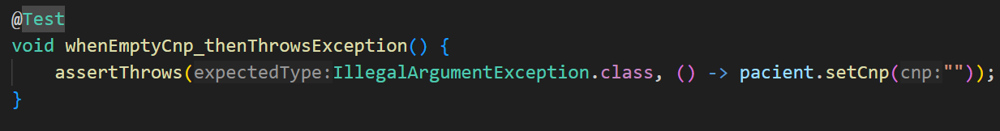

Explicație                  - utilizăm un set de date a tuturor combinațiilor posibile de parametri valizi, pentru a verifica dacă este creat corect

Test 2 - PacientTest.java
    Funcționalitate testată - setare și obținere CNP pacient
    Date de intrare         - valoare CNP
    Clase de echivalență    - CNP valid, CNP gol, CNP nul
    Test                    - CNP gol

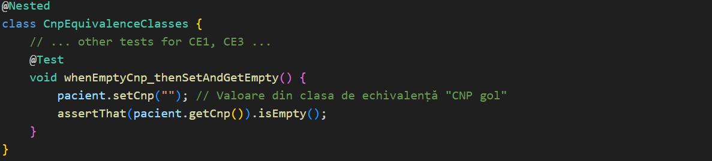

Explicație                  - se așteaptă ca sistemul să accepte un CNP gol și să îl stocheze.  

Test 3 - ProgramareTest.java
    Funcționalitate testată - obținere ID pacient din programare
    Clasă de echivalență    - programare cu ID valid de pacient
    Test                    - pacientIdCorect()

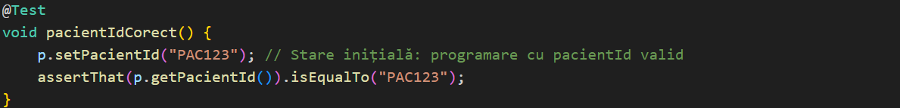

Explicație                  - verifică dacă getPacientId() returnează corect valoarea pentru o programare cu pacientId setat valid

Test 4 - RetetaTest.java
    Funcționalitate testată - starea inițială a unui obiect Reteta cu consutructor implicit
    Clasă de echivalență    - orice obiect Reteta nou creat in new Reteta(). Se așteaptă aceeași stare inițială
    Test specific           - campuriImpliciteNull()

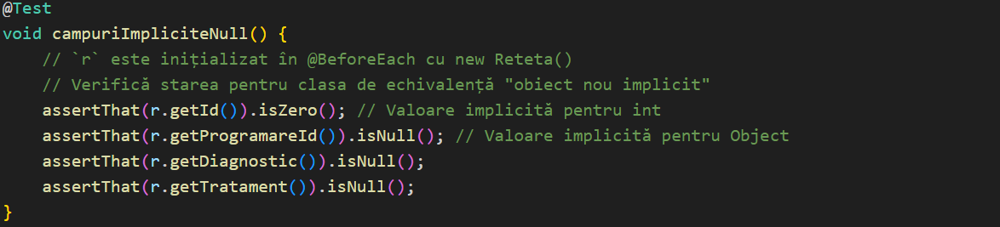

Explicație                  - testul validează că un obiect Reteta aparține clasei de echivalență a obiectelor cu câmpuri neinițializate sau default Java

Test 5 - CabinetMedicalTest.java
    Funcționalitate testată - căutare medic în cabinet
    Date de intrare         - ID medic
    Clase de echivalență    - ID medic care există / ca nu există
    Test specific           - medicNuExista()

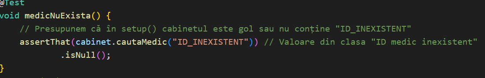

Explicație                  - verifică dacă metoda returnează null

Test 6 - ConsoleUITest.java
    Funcționalitate testată - procesarea unei opțiuni din meniul principal al consolei
    Date de intrare         - opțiunea aleasă
    Clase de echivalență    - cifră corespunzătoare / număr sau text invalid / intrare goală
    Test specific           - OpțiuneNonNumerica()

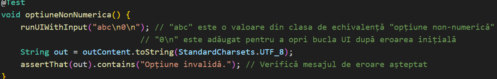

Explicație                  - abc ca intrare si se verifica daca afiseaza mesaj de eroare, pentru acest tip de intrare

A.2 Analiza valorilor de frontiera (BVA)

Se concentrează pe testarea valorilor de la marginile sau frontierele claselor de echivalență. Folosit pentur intervale numerice, lungimi de șiruri de caractere sau la limitele colecțiilor (goală / plină)

Test 1 - MedicTest.java
    Funcționalitate testată - setare ID medic
    Clase de echivalență    - ID negativ, zero, pozitive
    Valori de frontieră     - 0, -5, 123
    Test                    - seteazaIdValori() și IdImplicitZero()

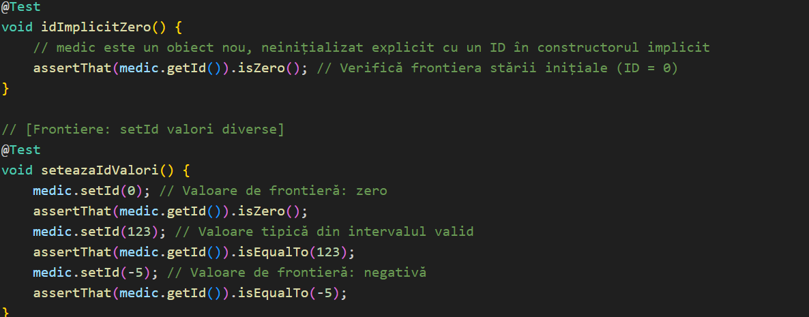

Test 2 - PacientTest.java
    Funcționalitate testată - setare CNP pacient (constrangere lungime)
    Clasa de echivalență    - CNP lungime 13, CNP lungime diferită de 13
    Valori de frontieră     - 12, 13, 14
    Test                    - Lungime 12 - CnpBoundaryAnalysis.whenCnpLength12_thenSetAndGet()

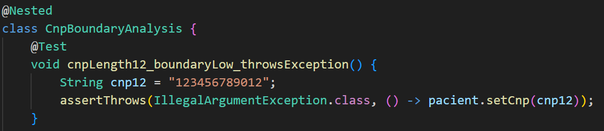    

Explicație                  - verifică comportamentul la 12

Test 3 - ProgramareTest.java
    Funcționalitate testată - calcul HashCode() pentru obiect din Programare
    Clasa de echivalență    - obiect Programare neinițializat vs Programare inițializat
    Valoare de frontieră    - trecerea de la o stare unde HashCode() ar putea să fie 0 la o stare diferită de zero
    Test                    - hashCodeNonZero()

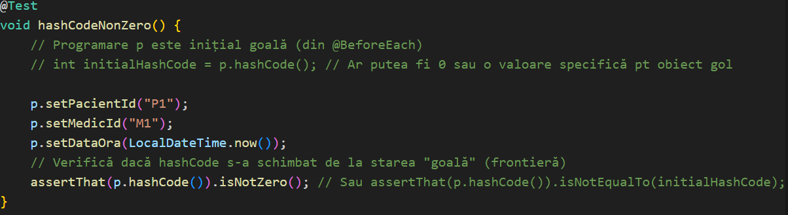

Explicație                  - verifică popularea câmpurilor, se verifică specififc isNotZero()

Test 4 - RetetaTest.java
    Funcționalitate testată - setare diagnostic retete
    Clase de echivalenta    - diagnostic valid, gol și nul
    Valoare de frontieră    - șirul gol ”” (între nul și cu conținut)
    Test                    - diagnosticGolEsteAcceptat()

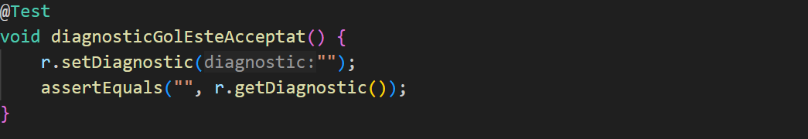

Explicație                  - verifică comportament la setare diagnostic cu șir gol

Test 5 - CabinetMedicalTest.java    
    Funcționalitate testată - adăugarea și căutare medic din listă
    Clase de echivalență    - listă goală, cu un element, mai multe elemente
    Valoare de frontieră    - o listă goală pentru operații cu colecții
    Test                    - MedicNuExista()

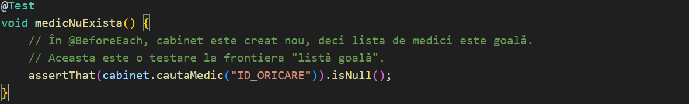

Explicație                  - când medicNuExista() este rulat imediat după setup(), lista de medici din cabinet este goală, cautăMedic verificat la frontiera unei colecții goale

Test 6 - ConsoleUITest.java
    Funcționalitate testată - selectare opțiuni meniu
    Clase de echivalență    - opțiuni valide, invalide
    Valori de frontiera     - valide: 0, 5; invalide: -1, 6
    Test                    - frontiera validă 0 - testAfișareMeniuPrincipal

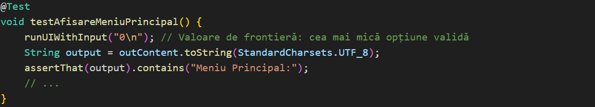

Explicație                  - gestionarea corectă a erorilor pentru valori de frontieră

B. Testare Structurală

Am folosit această strategie pentru cunoașterea detaliată a structurii interne a codului sursă, anume: logica, ramurile de decizie, buclele și căile de execuție. Scopul a fost pentru a proiecta teste care să asigure că părți ale codului sunt executate

B.1 Acoperire la nivel de instrucțiune

Pentru a asigura că fiecare linie de cod (instrucțiune) este executată cel puțin o dată

Test 1 - MedicTest.java
    Metode / Instrucțiuni   - interior metoda setSpecializare() și instrucțiunea returnare getSpecializare()
    Structura vizată        - execuția liniilor this.specializare = specializare; din setter și return this.specializare din getter
    Test                    - specializareValida()

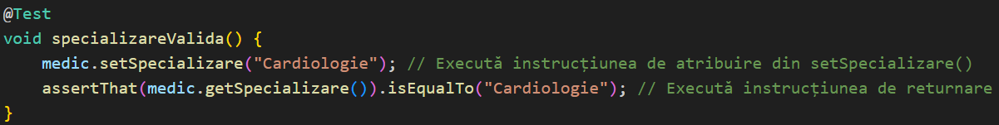

Explicație                  - se asigură că instrucțiunile se execută cel puțin o dată

Test 2 - PacientTest.java
    Metode / Instrucțiuni   - instrucțiuni atribuire constructor implicit și din setter setNume(), getter getNume()
    Structura vizată        - this.nume = nume din setNume() și return this.nume din getNume()
    Test                    - gettersAndSetters_workCorrectly

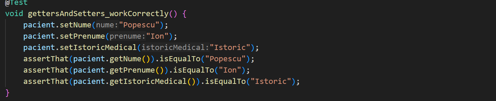

Explicație                  - se asigură că instrucțiunile sunt executate

Test 3 - ProgramareTest.java
    Metode / Instrucțiuni   - instrucțiuni atribuire setPacientId() si return getPacientId()
    Structura vizată        - this.pacientId = pacientId si return this.pacientId
    Test                    - PacientIdCorect()

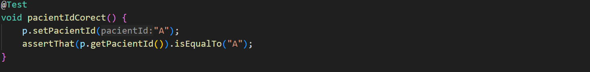

Explicație                  - se asigură că instrucțiunile sunt executate

Test 4 - RetetaTest.java
    Metode / Instrucțiuni   - instructiuni atribuire constructor implicit
    Structura vizată        - execuția constructorului public Reteta () si verificarea starii iniatiale a campurilor
    Test                    - campuriImpliciteNull()

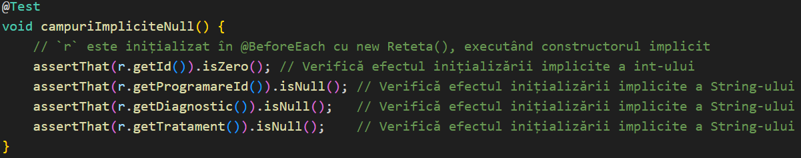

Explicație                  - verificare campuri dupa ce obiectul r a fost creat cu new Reteta() in setup() confirma ca instructiunile de initializare a campurilor au fost executate

Test 5 - CabinetMedicalTest.java
    Metode / Instrucțiuni   - adaugare Pacient in lista interna
    Structura vizată        - execuția pacienti.add(pacient) din metoda adaugaPacient a serviciului
    Test                    - adaugaPacientValid()

Explicație                  - apelarea cabinet.adaugaPacient(pacient) - asiguram ca instrucțiunea responsabilă este executată

Test 6 - ConsoleUITest.java
    Metode / Instrucțiuni   - instrucțiunile System.out.println() care afișează prompt-uri pentru adăgura pacient și apelul cabinetMock.adaugaMedic()
    Structura vizată        - execuția instrucțiunilor de afișare mesaje și a instrucțiunii pentur adaugare pacient catre serviciu
    Test                    - testAdaugaMedicFlow()

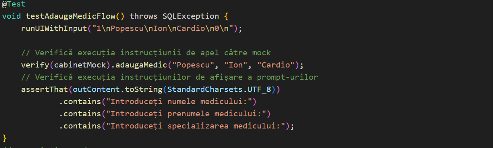

Explicație                  - asigură că instrucțiunile din ConsoleUI care afiseaza cererile de informatii pentru un pacient sunt executate (assertThat(outContent) și prin verify(cabinetMock) se confirma ca instructiunea care apeleaza adaugaMedic a fost executata

B.2. Acoperire nivel decizie / ramura 

Asiguram că fiecare posibil rezultat al unei structuri de decizie este parcurs cel puțin o data.

Test 1 - MedicTest.java
    Metoda / Decizia        - Metoda equals(Object obj) din Medic și decizia if (obj == null) return false
    Structura               - Ramura 1 (True): obj null ==> return false
                            - Ramura 2 (False): obj not null ==> continua dupa if
    Test                    - Ramura 1 - True - equalsCuNull()

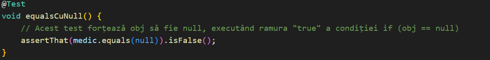

    Test                    - Ramura 2 - False - equalsAceeasiReferinta()

Test 2 - PacientTest.java
    Metoda / Decizia        - Metoda equals(Object obj) din Pacient. Decizia if (getClass() != obj.getClass()) return false
    Structura               - Ramura 1 (True): clasa obj this != obj ==> false
                            - Ramura 2 (False): clasele identice ==> continua executia
    Test                    - Ramura 1 - True - equals_differentClass()

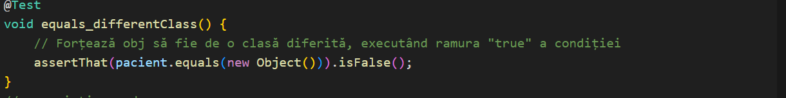

    Test                    - Ramura 2 - False - equals_sameObject()

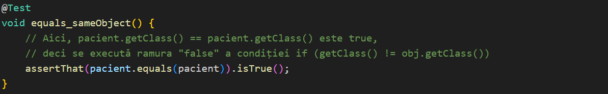

Test 3 - ProgramareTest.java
    Metoda / Decizia        - Metoda equals(Object obj) din Programare. Decizia care compara un camp if (!Objects.equals(pacientID, other.pacientId)) return false
    Structura               - Ramura 1 (True): pacientId sunt diferite ==> false
                            - Ramura 2 (False): pacientId sunt egale ==> continua executia
    Test                    - Ramura 1 - True - equalsPacientDiferit()

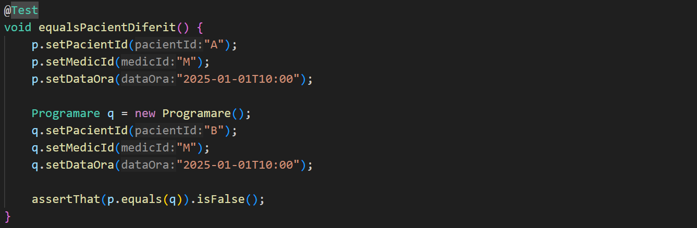

    Test                    - Ramura 2 - False - equalsMedicDiferit() - pacientId egal, medicId diferit
    
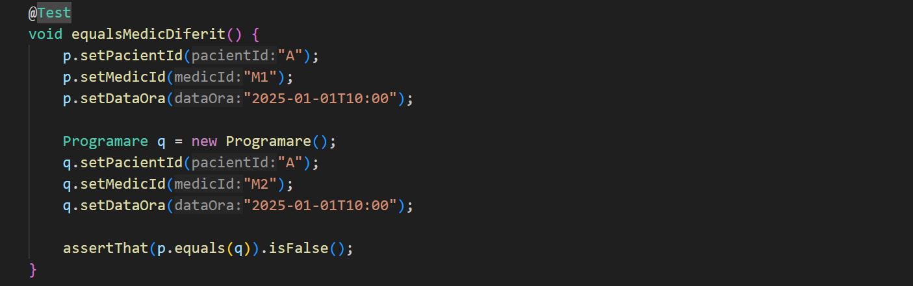

Test 4 - RetetaTest.java
    Metoda / Decizia        - Metoda equals(Object obj) din Reteta. Decizia if (obj == null) return false
    Structura               - Ramura 1 (True): obj null ==> false
                            - Ramura 2 (False): obj nu este null ==> se continua executia
    Test                    - Ramura 1 - True - equalsCuNull()

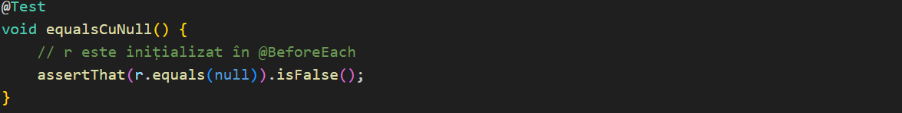

    Test                    - Ramura 2 - False - equalsAceeasiReferinta()

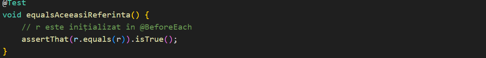

Test 5 - CabinetMedicalTest.java
    Metoda / Decizia        - CabinetMedical.anuleazaProgramare(Programare p) - succesul operatiei programari.remove(p)
    Structura               - Ramura 1: p exista in lista de programari si este stearsa
                            - Ramura 2: p nu exista in lsita de programari (neschimbata)
    Test                    - Ramura 1 - stergeProgramareExista()

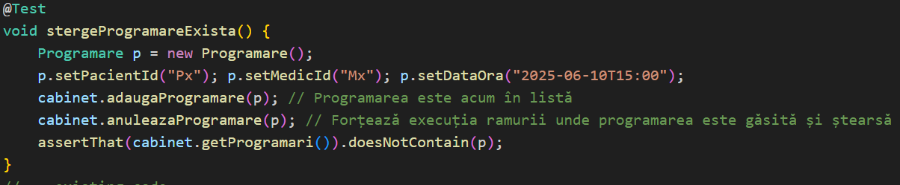

    Test                    - Ramura 2 - stergeprogramareInexista()

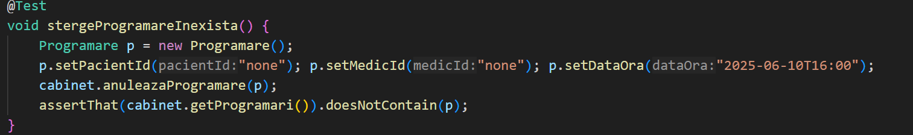

Test 6 - ConsoleuUITest.java
    Metoda / Decizia        - switch din ConsoleUI.start() care proceseaza optiunile. Fiecare case si ramura default reprezinta decizie
    Structura               - executie fiecare bloc case si a default
    Test                    - Case 1 - testAdaugaMedicFlow()

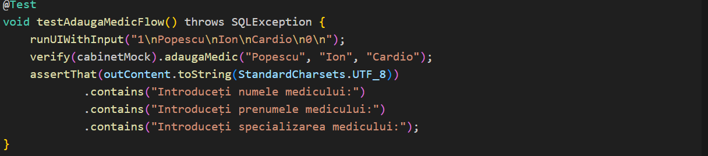

    Explicatie              - fiecare test flow testeaza o ramura case din switch + default

B.3. Acoperire nivel conditie

Folosim acest nivel de acoperire pentru multiple conditii atomice (sub-conditii) combinate prin operatori logici, fiecare conditie sa fie evaluata true cat si false cel putin o data. Descoperire erori

Metoda 1 - Programare.equals(Object obj)
    Decizie compusa         - if (obj == null || getClass() != obj.getClass()) {return false}
    Conditii atomice        - obj == null (C1) si getClass() != obj.getClass() (C2)
    Structura               - C1 si C2 evaluate la true si false
    Test                    - C1 la True - equalsCuNull() - ProgramareTest.java

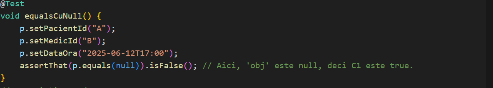

    Test                    - C1 la False si C2 la True - comparatieAltaClasa() din CabinetMedicalTest.java

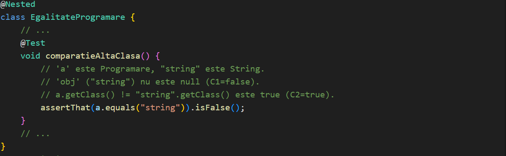

    Test                    - C1 la False si C2 la False - simetric() din CabinetMedicalTest.java

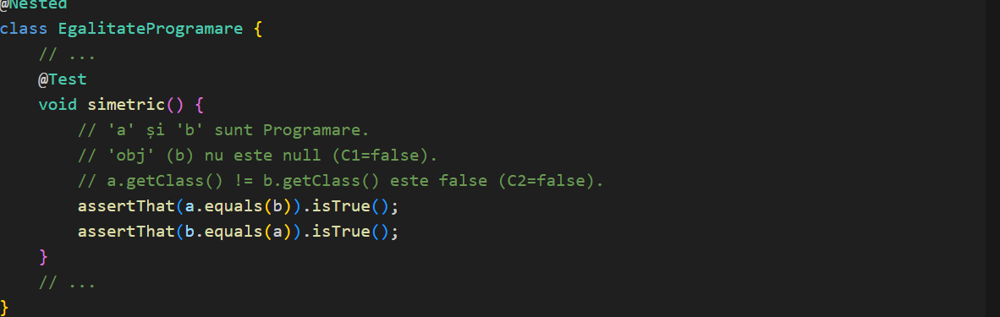

    Explicatie              - contribuie la partea initiala a metodei

Metoda 2 - Pcient.setCNP(String cnp)
    Decizie compusa         - if (cnp == null || cnp.trim().isEmpty() {throw new IllegalArgumentException("CNP invalid"); }
    Conditii atomice        - cnp == null (C1) si cnp.trim().isEmpty() (C2)
    Structura               - C1 si C2 evaluate la true si false
    Test                    - PacientTest.java (CnpEquivalenceClasses) C1 True cu whenNullCnp_thenThrowsExceptions()

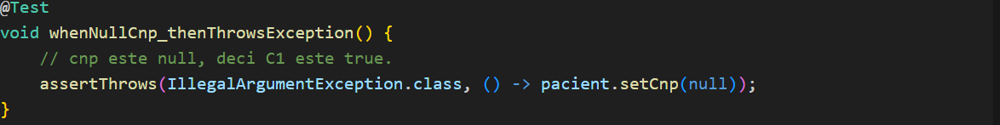

    Test                    - C1 False si C2 True cu whenEmptyCnp_thenThrowsException()

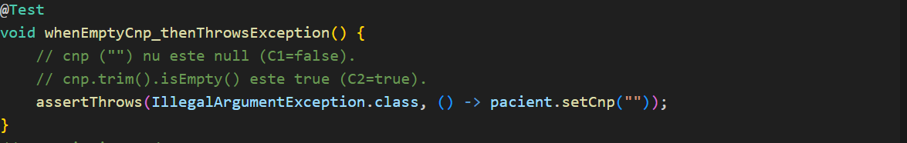

    Test                    - C1 False si C2 False cu whenValidCnpLength13_thenSetAndGet()

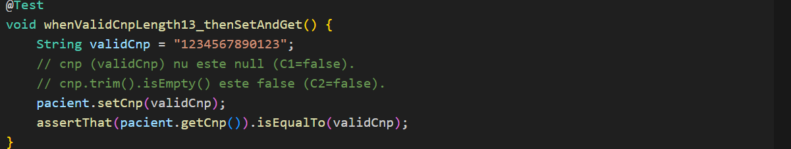

B.4 Acoperire circuite independente

Urmărim executarea cât mai multor instrucțiuni și parcurgerea tuturor ramurilor decizionale. Complexitatea ciclomatică a unei metode oferă o limită superioară pentru numărul de teste necesare pentru a acoperi toate căile liniar independente

Test 1 - MedicTest.java
    Functionalitate / Metoda    - equals() din Medic.
    Cai de testat               - Calea 1: obj este this (reflexivitate) ==> equalsAceeasiReferinta()
                                - Calea 2: obj este null ==> equalsCuNull()
                                - Calea 3: obj este de alta clasa ==> equalsCuAltaClasa()
                                - Calea 4: toate campurile egale ==> equalsObiecteEgale()
                                - Calea 5: ID diferite, restule egale ==> equalsDiferit(), similar nume, prenume, specializare
                                
Test 2 - ProgramareTest.java
    Functionalitate / Metoda    - Programare.equals(Object obj)
    Cai de testat               - Calea 1: aceeasi referinta ==> equalsAceeasiInstanta()
                                - Calea 2: obj este null ==> equalsCuNull()
                                - Calea 3: obj este de alta clasa ==> equalsCuAltaClasa()
                                - Calea 4: primul camp pacientId difera ==> equalsPacientDiferit()
                                - Calea 5: medicId diferit ==> equalsMedicDiferit()
                                - Calea 6: dataOra difera ==> equalsDataDiferita()
                                - Calea 7: equalsToateEgale()

Test 3 - ConsoleUITest.java
    Functionalitate / Metoda    - ConsoleUI.start(). Switch (if-else if)
    Cai de testat               - Calea 1: 1 ==> testAdaugaMedicFlow()
                                - Calea 2: 2 ==> testAdaugaPacientFlow()
                                - Calea 3: 3, 4, 5 ==> test
                                - Calea 4: 0 ==> TestAfisareMeniuPrincipal()
                                - Calea 5: 9 ==> optiuneInvalidaEroare()
                                - Calea 6: abc ==> optiuneNonNumerica()
    Explicatie                  - se directioneaza executiile pe cai distince, corespunzatoare optiunilor

C. Testare prin Mutatie

Tehnica de testare structurala utilizata pentru a evalua calitatea si puterea unei suite de teste. Scenarii pe care testele nu le acopera suficient de bine 

Proces
    1. Introducere automata modificari (mutatii) in cod sursa. Schimbare operator, stergere linii cod, inlocuire constante
    2. Suita de teste rulata pe fiecare mutant
    3. Daca suita esueaza ==> mutant omorat (testele detecteaza modificarea)
    4. Daca suita nu esueaza ==> mutant supravietuit (testele nu detecteaza modificarea)
    5. Scop cat mai mare de acoperire

Teste pentru eliminarea mutantilor ramasi

Test 1 - equalsDataDiferitaFalse() - pentru a elimina un mutant in Programare.equals() din CabinetMedicalTest.java

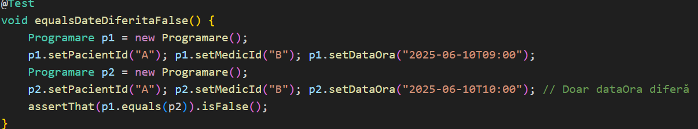

Context - Presupunem ca metoda Programare.equals(Object obj) contine urmatoarea logica pentru a compara campul dataOra

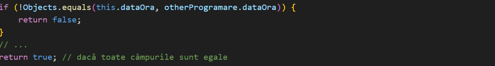

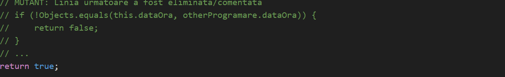

Eliminare mutant - testul creeaza doua obiecte PRogramare p1 si p2, care sunt identice cu exceptia dataOra. Daca mutantul ignora comparatia, atunci returneaza true pentru p1.equals(p2), dar asertiunea este asserThat(p1.equals(p2)).isFalse().
Deoarece mutantul returneaza true iar testul asteapta false - va esua, astfel este eliminat

Test 2 - equalsPacientMedicDiferitFalse() in Programare.equals() din CabinetMedicalTest.java

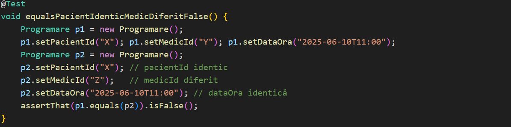

Context - P.p. medicId similar

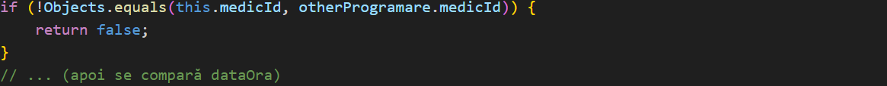

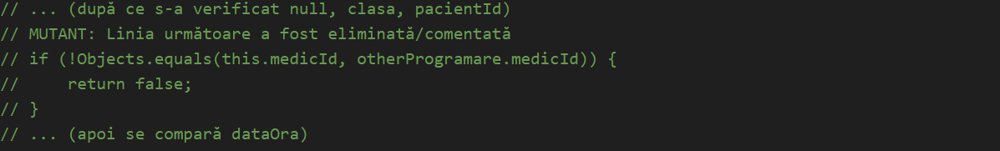

Eliminare mutant - testul creeaza p1 si p2 identice, a.i. pacientId si dataOra identice si medicId diferrit - similar cu test 1

Teste suplimentare eliminare mutanti
Nu se verificau efectiv prompt-uri/mesaje afisate la consola
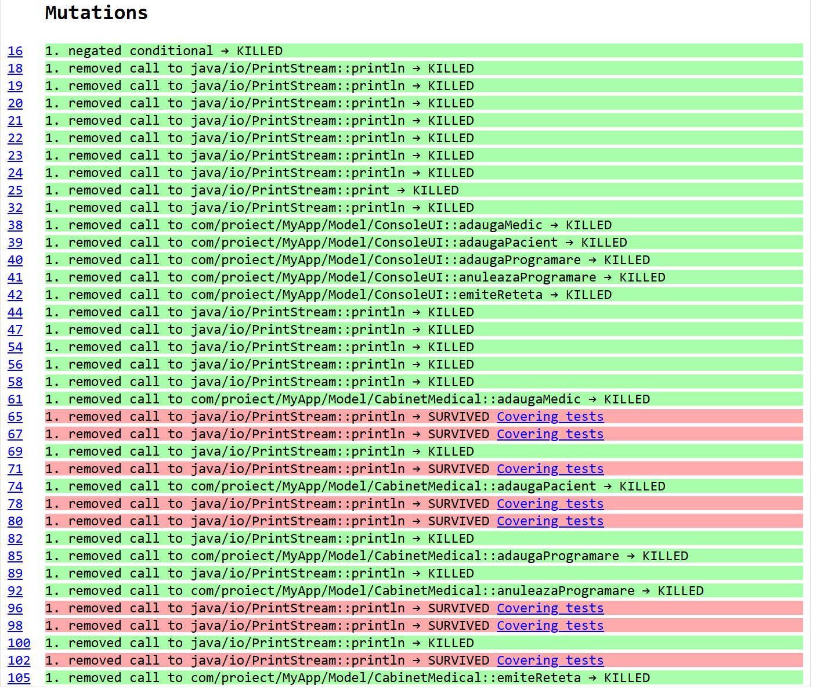

Noul test simuleaza o serie completa de interactiuni cu interfata utilizator din consola, astfel asertiunile verifica daca un anumit promp este prezent in output

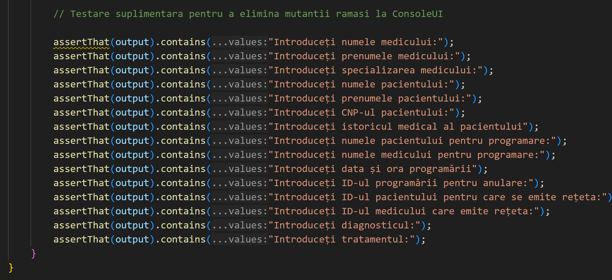

**7. Rezultate si Concluzii**

A. Testare Functionala pachet com.proiect.MyApp.Model - Raport

Testele au demonstrat ca se comporta conform asteptarilor pentru cazurile de testare definite

[text](<Test%20Results%20-%20test_in_ProiectRC.html>)

B. Testare Structurala pachet com.proiect.MyApp.Model - Raport

Raportul a relevat o buna acoperire interna a codului, cu reflectarea corectitudinii implementarii

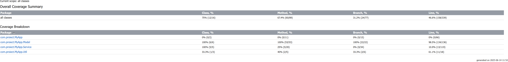

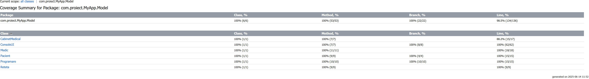

C. Testare prin Mutatie pachet com.proiect.MyApp.Model - Raport

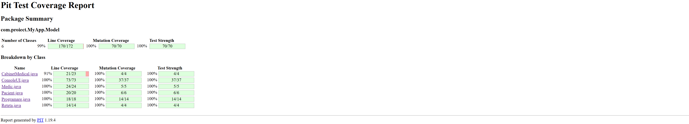

Line coverage 21/23 deoarece niciun test nu provoaca Exception in timpul executiei try (se desfasoara intotdeauna cu succes)
Greu de simulat acoperirea blocului catch

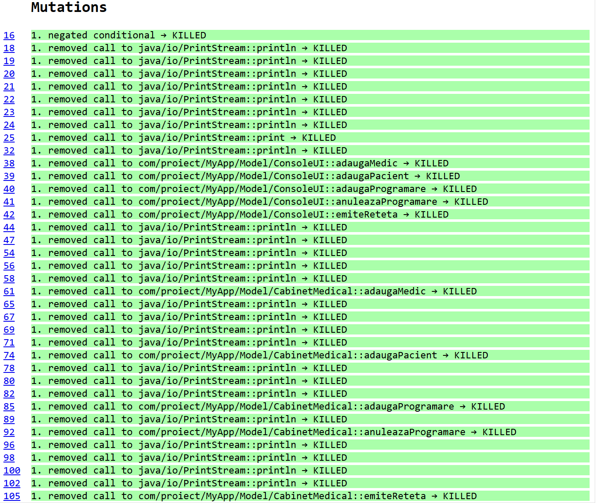

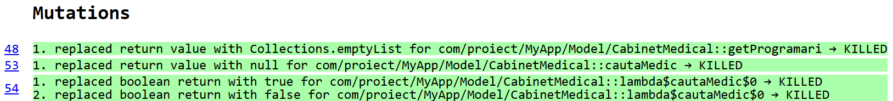

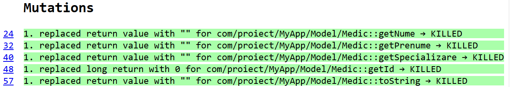

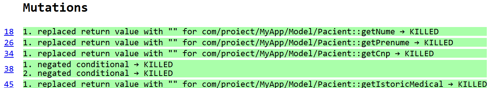

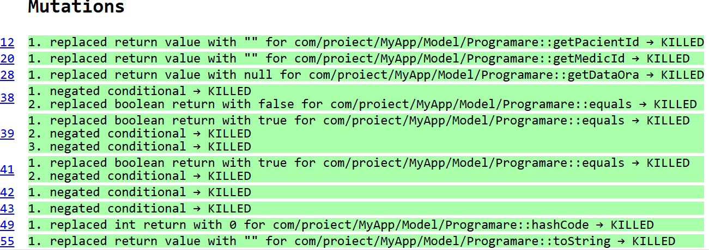

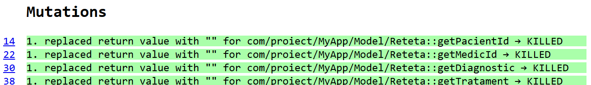

D. Raport AI pachet com.proiect.MyApp.Model - ChatGPT 

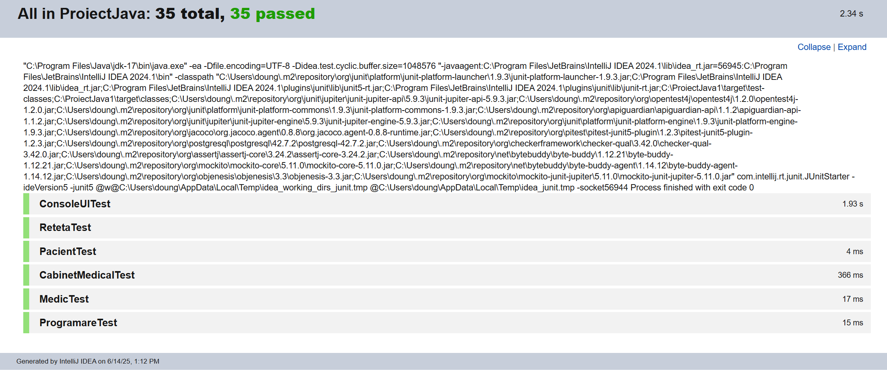

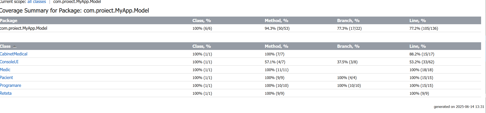

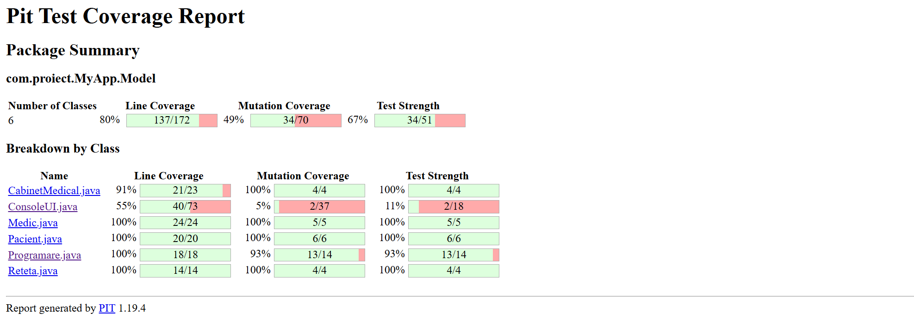

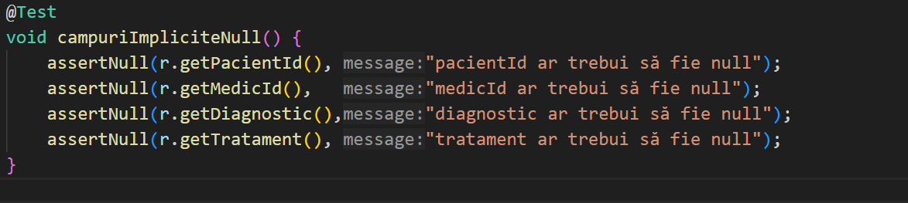

Cauze probabile: Testele nu verifică output-ul efectiv la consolă pe care ConsoleUI îl generează (prompt-uri, mesaje)
Nicio aserțiune nu le validează 
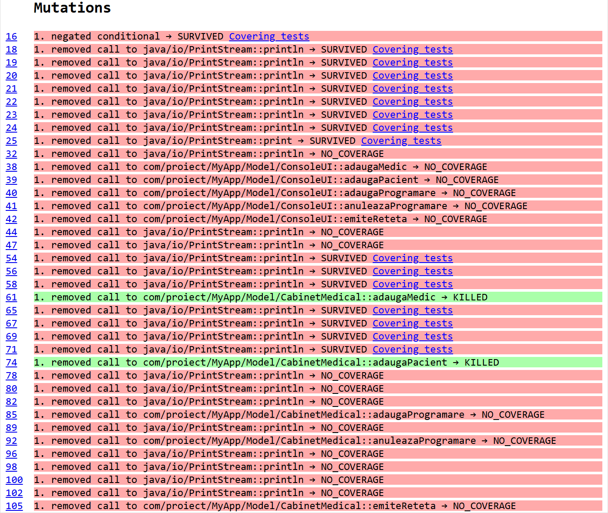

**8. Referinte**

[1] JUnit 5 Documentation
[2] PITest Mutation Testion
[3] ChatGPT (generare teste automate, configurare pom, asistare teste)
[4] Mockito Documentation
[5] AssertJ Documentation
[6] Dobrescu, Ion. Software Testing in Java, 2022
[7] Documentatie curs TSS 2025
[8] IntelliJ IDEA Documentation
[9] Maven - Build Automation Tool
[10]Oracle - Java Documenation    
[11]BellSoft, „A comprehensive Guide to Mutation Testing In Java”, 2025
[12]Baeldung, „Mutation Testing with PITest”, 2023